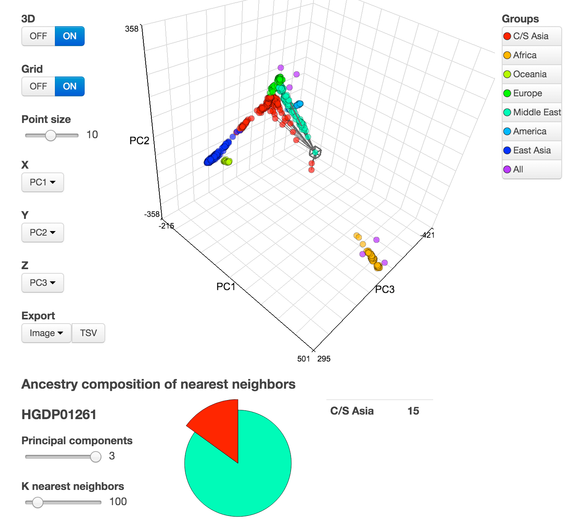
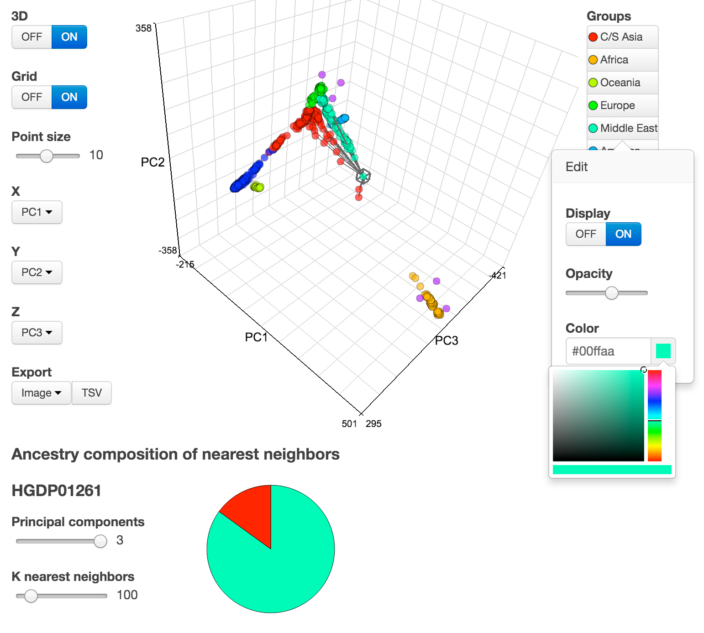
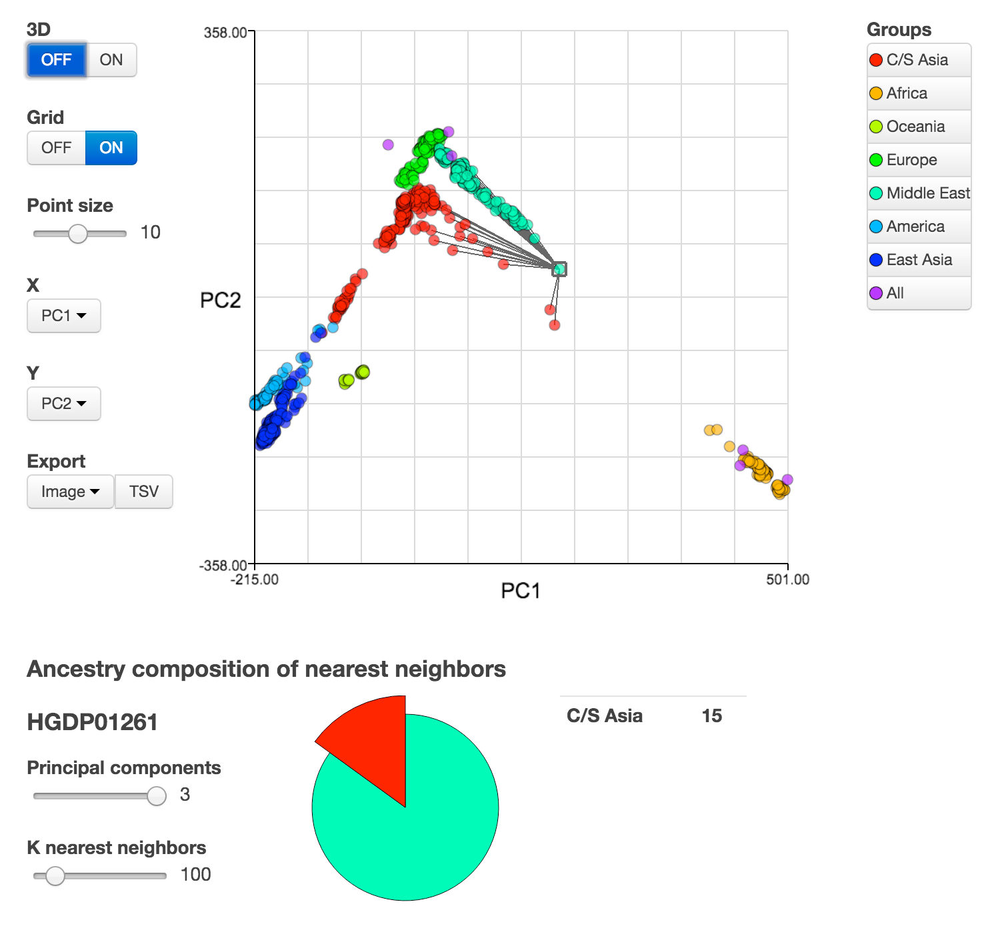

#23IV
Javascript modules for 2D and 3D Interactive Visualization (23IV) of principal components on web.

##Example
A running example is available from http://statgen.github.io/23IV/example.html. 
An example input data is available from https://raw.githubusercontent.com/statgen/23IV/master/example_data.tsv.

##Screenshots

####3D view with selected point and its 100 nearest neighbors

####3D view with opened color picker dialog

####2D view of same data

